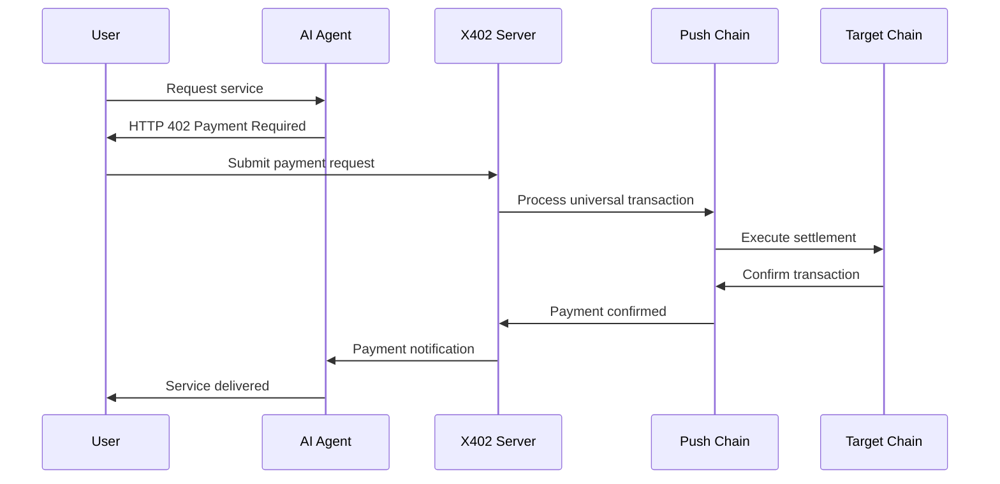

# X402 + Push Chain Universal Transactions Tutorial

An advanced integration tutorial demonstrating how to combine the X402 Agent-to-Agent (A2A) payment protocol with Push Chain's Universal Transactions, enabling seamless cross-chain payments for AI agents and applications.

## Credits
We built this tutorial on top of the reference implementation by Nader Dabit:

- **Repository**: [dabit3/a2a-x402-typescript](https://github.com/dabit3/a2a-x402-typescript)
- **Video overview**: [YouTube walkthrough](https://www.youtube.com/watch?v=h75LRiymYX8)

## Overview

This tutorial showcases the powerful combination of two cutting-edge technologies:

1. **X402 Protocol**: A standardized payment request system for AI agents
2. **Push Chain Universal Transactions**: Cross-chain transaction execution that works across EVM and non-EVM networks

Together, they enable AI agents to request and receive payments from users across any supported blockchain, while maintaining a simple, consistent interface for developers.

## What This Tutorial Demonstrates

### X402 Protocol Integration
- **Exception-based Payment Requests**: AI agents can request payments by throwing HTTP 402 exceptions
- **Signed Payment Payloads**: Cryptographically signed payment confirmations for security
- **Agent-to-Agent Commerce**: Standardized payment flows between AI agents and users
- **Programmable Settlement**: Merchants define custom settlement logic and rules

### Push Chain Universal Transactions
- **Cross-Chain Payments**: Users can pay from Ethereum, Solana, or any supported chain
- **Universal Account System**: Single account works across all supported networks
- **Chain-Agnostic Settlement**: Merchants receive payments regardless of user's source chain
- **Unified Developer Experience**: One API for all blockchain interactions

### Combined Benefits
- **Enhanced User Experience**: Users aren't locked to specific chains or assets
- **Simplified Integration**: Merchants implement one payment system for all chains
- **AI-Native Payments**: Purpose-built for AI agent commerce scenarios
- **Future-Proof Architecture**: Supports new chains as they're added to Push Chain

## Architecture Flow



## Key Features

### For Users
- **Multi-Chain Flexibility**: Pay from any supported blockchain
- **Unified Wallet Experience**: One account for all transactions
- **Reduced Friction**: No need to bridge assets or switch networks
- **Enhanced Security**: Cryptographically signed payment confirmations

### For Merchants/AI Agents
- **Simple Integration**: One API for all payment scenarios
- **Programmable Logic**: Custom settlement rules and conditions
- **Cross-Chain Revenue**: Accept payments from any supported network
- **Standardized Protocol**: Compatible with X402 ecosystem

### For Developers
- **Unified SDK**: Single development experience across chains
- **Extensible Architecture**: Easy to add new payment types and chains
- **Production Ready**: Built on proven X402 and Push Chain infrastructure
- **Comprehensive Documentation**: Clear guides and examples

## Technical Implementation

### X402 Payment Flow
1. **Service Request**: User requests service from AI agent
2. **Payment Exception**: Agent responds with HTTP 402 and payment details
3. **Payment Processing**: User authorizes payment through X402 interface
4. **Universal Transaction**: Payment executed via Push Chain across any supported network
5. **Settlement Confirmation**: Merchant receives payment confirmation
6. **Service Delivery**: Agent delivers requested service to user

### Push Chain Integration
- **Universal Account**: Single account abstraction across all chains
- **Cross-Chain Routing**: Automatic routing of transactions to optimal chains
- **Gas Optimization**: Intelligent gas management across networks
- **State Synchronization**: Consistent state across all supported chains

## Use Cases

### AI Agent Commerce
- **Content Generation**: Pay AI agents for custom content creation
- **Data Analysis**: Commission AI for specialized data processing
- **API Services**: Pay-per-use AI API endpoints
- **Computational Tasks**: Outsource heavy computation to AI agents

### Cross-Chain Applications
- **DeFi Protocols**: Multi-chain yield farming and trading
- **NFT Marketplaces**: Buy/sell NFTs across different chains
- **Gaming Platforms**: In-game purchases from any blockchain
- **Subscription Services**: Cross-chain recurring payments

## Getting Started

### Prerequisites
- Node.js (v16 or higher)
- Basic understanding of blockchain concepts
- Familiarity with AI agent architectures
- Knowledge of HTTP protocols and REST APIs

### Quick Start
1. **Clone the repository**
2. **Install dependencies**: `npm install`
3. **Configure environment**: Set up API keys and endpoints
4. **Run the example**: `npm start`
5. **Test payments**: Use the provided test interface

## Project Structure

```
x402-universal-transaction/
├── src/
│   ├── agents/          # AI agent implementations
│   ├── x402/           # X402 protocol handlers
│   ├── pushchain/      # Push Chain integration
│   └── examples/       # Usage examples
├── docs/               # Additional documentation
├── tests/              # Test suite
└── README.md          # This file
```

## Configuration

### Environment Variables
```env
PUSH_CHAIN_API_KEY=your_api_key
X402_MERCHANT_ID=your_merchant_id
SUPPORTED_CHAINS=ethereum,solana,polygon
SETTLEMENT_ADDRESS=your_settlement_address
```

### Network Configuration
- **Mainnet**: Production environment with real assets
- **Testnet**: Development environment for testing
- **Local**: Local development with mock services

## Examples and Use Cases

### Basic Payment Request
```typescript
// AI Agent throws payment exception
throw new X402Exception({
  amount: "10.00",
  currency: "USDC",
  description: "AI content generation service",
  merchantId: "ai-agent-123"
});
```

### Cross-Chain Settlement
```typescript
// Push Chain handles cross-chain execution
const payment = await pushChain.processPayment({
  from: userAccount,
  to: merchantAccount,
  amount: paymentAmount,
  sourceChain: "ethereum",
  targetChain: "solana"
});
```

## Security Considerations

### Payment Security
- **Cryptographic Signatures**: All payments cryptographically signed
- **Replay Protection**: Nonce-based replay attack prevention
- **Amount Validation**: Server-side payment amount verification
- **Timeout Handling**: Automatic expiration of payment requests

### Cross-Chain Security
- **Bridge Validation**: Secure cross-chain message validation
- **State Verification**: Cryptographic proof of cross-chain state
- **Slashing Conditions**: Economic incentives for honest behavior
- **Emergency Stops**: Circuit breakers for security incidents

## Performance and Scalability

### Transaction Throughput
- **Parallel Processing**: Concurrent transaction execution
- **Batch Operations**: Multiple payments in single transaction
- **Layer 2 Integration**: Support for scaling solutions
- **Caching Strategies**: Optimized data retrieval and storage

### Network Optimization
- **Intelligent Routing**: Optimal path selection for cross-chain transactions
- **Gas Estimation**: Accurate gas cost prediction across chains
- **Fee Optimization**: Minimize transaction costs for users
- **Load Balancing**: Distribute load across multiple nodes

## Troubleshooting

### Common Issues
1. **Payment Timeouts**: Check network connectivity and gas prices
2. **Cross-Chain Delays**: Verify bridge status and finality requirements
3. **Signature Failures**: Ensure correct key management and signing
4. **Agent Connectivity**: Verify AI agent endpoints and authentication

### Debug Tools
- **Transaction Explorer**: Track payments across chains
- **Log Aggregation**: Centralized logging for debugging
- **Performance Metrics**: Monitor system performance and bottlenecks
- **Test Suite**: Comprehensive testing for all scenarios

## Contributing

We welcome contributions to improve this tutorial and extend its capabilities:

1. **Fork the repository**
2. **Create feature branch**: `git checkout -b feature/amazing-feature`
3. **Commit changes**: `git commit -m 'Add amazing feature'`
4. **Push to branch**: `git push origin feature/amazing-feature`
5. **Open Pull Request**: Submit your changes for review

## Credits and Acknowledgments

This tutorial builds upon the foundational work of several key contributors:

### Original X402 Implementation
- **Nader Dabit** - Original X402 A2A payments reference implementation
- **Repository**: [dabit3/a2a-x402-typescript](https://github.com/dabit3/a2a-x402-typescript)
- **Video Overview**: [YouTube Walkthrough](https://www.youtube.com/watch?v=h75LRiymYX8)

### Push Chain Integration
- **Push Protocol Team** - Universal Transactions infrastructure and SDK
- **Community Contributors** - Testing, feedback, and improvements

### Special Thanks
- **X402 Protocol Designers** - For creating the agent payment standard
- **Push Chain Developers** - For enabling seamless cross-chain transactions
- **Early Adopters** - For testing and providing valuable feedback

## Resources and Further Reading

### Documentation
- [Push Chain Documentation](https://push.org/docs)
- [X402 Protocol Specification](https://x402.org)
- [Universal Transactions Guide](https://push.org/docs/chain/universal-transactions)

### Community
- [Push Protocol Discord](https://discord.gg/pushprotocol)
- [X402 Community Forum](https://forum.x402.org)
- [GitHub Discussions](https://github.com/push-protocol/push-chain-examples/discussions)

### Additional Examples
- [Simple Counter Tutorial](../simple-counter/)
- [Batch Transactions Tutorial](../batch-universal-transactions/)
- [Universal ERC20 Mint](../universal-erc-20-mint/)

## License

This project is licensed under the MIT License - see the [LICENSE](LICENSE) file for details.
